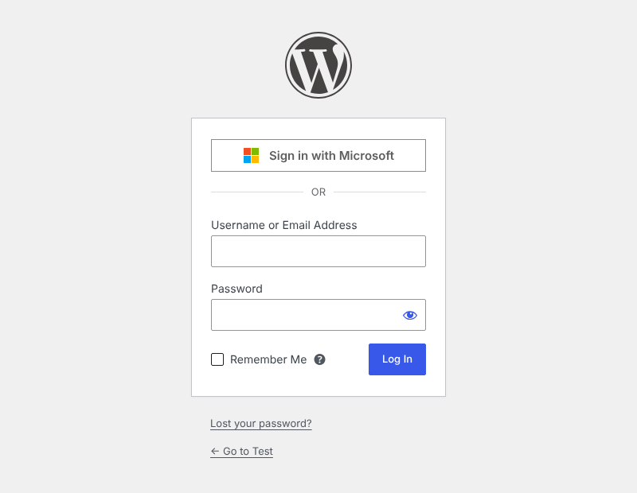

# SSO Login for Microsoft Entra ID

[](https://github.com/Aryal-rajiv/Microsoft-Login-Plugin/actions/workflows/ci.yml)


A WordPress plugin that lets people sign in with their Microsoft work or school account through **Microsoft Entra ID** (formerly Azure Active Directory) single sign-on.

It adds a **Sign in with Microsoft** button to `wp-login.php`, links Microsoft accounts to WordPress users, and can create users and assign roles from Entra ID app roles or groups. It talks directly to the Microsoft identity platform using OpenID Connect; no third-party service is involved.

<p align="center"></p>

## Contents

- [Features](#features)
- [Requirements](#requirements)
- [Installation](#installation)
- [Microsoft Entra ID setup](#microsoft-entra-id-setup)
- [Settings reference](#settings-reference)
- [Mapping Entra ID roles and groups to WordPress roles](#mapping-entra-id-roles-and-groups-to-wordpress-roles)
- [Keeping credentials in wp-config.php](#keeping-credentials-in-wp-configphp)
- [Shortcode](#shortcode)
- [How sign-in works](#how-sign-in-works)
- [Security](#security)
- [Troubleshooting](#troubleshooting)
- [Developer reference](#developer-reference)
- [Development](#development)
- [Upgrading from 1.x](#upgrading-from-1x)
- [License](#license)

## Features

- **Sign in with Microsoft** button on the login page, styled to Microsoft's branding guidelines.
- **Redirect mode**: skip the WordPress form and send visitors straight to Microsoft (`wp-login.php?local=1` still shows the form).
- **Link existing users** by email on first sign-in, then by the immutable Entra object ID from then on.
- **Create users automatically** (optional) with a default role.
- **Role mapping** from Entra ID app roles or security groups, with optional **role sync** on each sign-in.
- **Allowed tenants** and **allowed email domains** to control who can sign in.
- **Single sign-out** from Microsoft when logging out of WordPress (optional).
- **`[msentra_sso_login]` shortcode** to put the button on any page.
- **wp-config.php constants** for the client ID, tenant ID and secret.
- Single-tenant, multi-tenant, personal accounts and national clouds.
- Multisite compatible, translation ready, clean uninstall.

## Requirements

| Requirement | Version |
| --- | --- |
| WordPress | 6.0 or later (tested up to 7.1) |
| PHP | 7.4 or later (tested up to 8.3) |
| HTTPS | Required in production. Microsoft only accepts `https://` redirect URIs, except for `http://localhost`. |
| Microsoft Entra ID | A tenant where you can create an app registration. Every Microsoft 365 business subscription includes one. |

## Installation

**From a release zip**

1. Download `sso-login-for-microsoft-entra-id.zip` from the [Releases](https://github.com/Aryal-rajiv/Microsoft-Login-Plugin/releases) page.
2. In WordPress go to **Plugins → Add New → Upload Plugin**, choose the zip and click **Install Now**.
3. Click **Activate**.

**From source**

```bash
cd wp-content/plugins
git clone https://github.com/Aryal-rajiv/Microsoft-Login-Plugin.git sso-login-for-microsoft-entra-id
```

Then activate **SSO Login for Microsoft Entra ID** on the Plugins screen.

After activating, go to **Settings → Microsoft Entra SSO**.

## Microsoft Entra ID setup

1. In WordPress, open **Settings → Microsoft Entra SSO** and copy the **Redirect URI**. It is your login URL, e.g. `https://example.com/wp-login.php`.
2. Sign in to the [Microsoft Entra admin center](https://entra.microsoft.com/) and go to **Identity → Applications → App registrations → New registration**.
3. Fill in the form:
   - **Name**: e.g. `WordPress – example.com`.
   - **Supported account types**: *Accounts in this organizational directory only* (recommended).
   - **Redirect URI**: select **Web** and paste the URI from step 1.
4. Click **Register**. On the **Overview** page copy the **Application (client) ID** and the **Directory (tenant) ID**.
5. Open **Certificates & secrets → Client secrets → New client secret**. Pick an expiry, click **Add**, and copy the **Value** right away (it is shown only once; the *Secret ID* is not what you need).
6. Back in WordPress, paste the client ID, tenant ID and secret, then click **Save Changes**.
7. Open the login page in a private window and click **Sign in with Microsoft**.

The default API permission `Microsoft Graph → User.Read` is all the plugin needs. It is used to read the signed-in user's name and email address.

> **Tip:** Client secrets expire (at most 24 months). Put a reminder in your calendar to create a new one before the old one expires, or sign-ins will fail with `AADSTS7000222`.

### Optional: restrict who can sign in

By default every user in your directory can sign in (as long as they have, or are allowed to get, a WordPress account). To limit it to specific people:

1. Go to **Enterprise applications** → your app → **Properties** and set **Assignment required?** to **Yes**.
2. Under **Users and groups**, assign the users or groups that should have access.

## Settings reference

### Connection

| Setting | Description |
| --- | --- |
| **Redirect URI** | Read-only. Register it as a **Web** redirect URI on the app registration. |
| **Application (client) ID** | From the app registration's Overview page. |
| **Directory (tenant) ID** | Your tenant ID (recommended) or a verified domain such as `contoso.onmicrosoft.com`. Use `organizations`, `common` or `consumers` only for multi-tenant apps. |
| **Client secret** | The secret **Value**. Leave blank to keep the saved secret. It is never displayed again. |
| **Allowed tenant IDs** | Required in multi-tenant mode: only these directories can sign in. Ignored when a single tenant is configured. |

### Users and roles

| Setting | Default | Description |
| --- | --- | --- |
| **Existing users** | On | Link a Microsoft account to an existing WordPress user with the same email address on first sign-in. |
| **New users** | Off | Create a WordPress user on first sign-in. When off, only people with an existing account can sign in. |
| **Default role** | Subscriber | Role for new users when no mapping rule matches. Administrator is not offered here on purpose. |
| **Allowed email domains** | – | Only accept these email domains (one per line). Empty means any domain. |
| **Role mapping** | – | See [below](#mapping-entra-id-roles-and-groups-to-wordpress-roles). |
| **Role sync** | Off | Re-apply the role mapping on every sign-in for users who match a rule. |

### Login experience

| Setting | Default | Description |
| --- | --- | --- |
| **Login page** | Button | *Button* shows the Microsoft button above the normal form. *Redirect* sends visitors straight to Microsoft; `wp-login.php?local=1` still shows the form. |
| **Button text** | Sign in with Microsoft | Custom label for the button. |
| **After sign-in** | Dashboard | Where to go after signing in when no `redirect_to` was requested. Users who cannot edit posts go to their profile, like in core. |
| **Sign out** | Off | Also end the Microsoft session when the user logs out of WordPress (only for sessions that started with Microsoft). |

## Mapping Entra ID roles and groups to WordPress roles

Add one rule per line in **Role mapping**:

```
<app role value or group object ID> = <WordPress role slug>
```

Example:

```
WordPress.Admin  = administrator
WordPress.Editor = editor
0b9a5c3e-1d2f-4a6b-8c7d-9e0f1a2b3c4d = author
```

The first matching line wins, so put the most privileged roles first.

**Using app roles (recommended)**

1. In the app registration open **App roles → Create app role**. Allowed member types: *Users/Groups*. Value: e.g. `WordPress.Admin`.
2. In **Enterprise applications** → your app → **Users and groups**, assign the role to users or groups.
3. The role values arrive in the ID token's `roles` claim.

**Using security groups**

1. In the app registration open **Token configuration → Add groups claim**, select *Security groups* and make sure *ID* tokens include *Group ID*.
2. Use the group's **Object ID** in the mapping.
3. Users in more than 200 groups get no `groups` claim (Microsoft's "overage" limit). Prefer app roles for large organizations.

**When is the mapping applied?**

- New users always get the mapped role (or the default role).
- Existing users only get it when **Role sync** is on and a rule matches. Users who match no rule are never changed.

> **Warning:** Before enabling Role sync, make sure your own account matches the `administrator` rule, or you will lose administrator access on your next Microsoft sign-in.

## Keeping credentials in wp-config.php

Constants take precedence over the settings page, and the matching fields become read-only:

```php
define( 'MSENTRA_SSO_CLIENT_ID', '00000000-0000-0000-0000-000000000000' );
define( 'MSENTRA_SSO_TENANT_ID', '00000000-0000-0000-0000-000000000000' );
define( 'MSENTRA_SSO_CLIENT_SECRET', 'your-secret-value' );
```

This keeps the secret out of database backups and lets you use different app registrations per environment (staging, production).

## Shortcode

```
[msentra_sso_login]
[msentra_sso_login text="Staff login" redirect_to="https://example.com/intranet/"]
```

| Attribute | Description |
| --- | --- |
| `text` | Button label. Defaults to the **Button text** setting. |
| `redirect_to` | Where to go after signing in. Defaults to the current page. Must be on your site. |

The shortcode outputs nothing for visitors who are already logged in.

In PHP templates you can use `do_shortcode( '[msentra_sso_login]' )`, or build a link with `\MSEntraSSO\Authenticator::login_url( $redirect_to )`.

## How sign-in works

```
Browser                      WordPress (wp-login.php)                 Microsoft
   │  click "Sign in with Microsoft"   │                                   │
   ├──────────────────────────────────►│ ?action=msentra_sso               │
   │                                   │ create state, nonce, PKCE         │
   │◄──────────── 302 ─────────────────┤ set browser-bound state cookie    │
   ├──────────────────────────────────────────────────────────────────────►│ /authorize
   │                     user signs in (MFA, Conditional Access, …)        │
   │◄──────────────────────────────────────────────── 302 ?code&state ─────┤
   ├──────────────────────────────────►│ verify state + cookie (one use)   │
   │                                   ├──────── code + verifier ─────────►│ /token
   │                                   │◄─────── ID token + access token ──┤
   │                                   │ validate ID token claims          │
   │                                   ├──────── GET /me ─────────────────►│ Graph
   │                                   │ find / link / create user         │
   │◄──── 302 + auth cookie ───────────┤ apply role mapping, log in        │
```

User matching, in order:

1. A user already linked to the Microsoft account (`tid:oid` stored in the `msentra_sso_identity` user meta).
2. If **Existing users** is on: a user with the same email address, which is then linked. If that user is already linked to a *different* Microsoft account, sign-in is refused.
3. If **New users** is on: a new user is created.

The email address is taken from Microsoft Graph `mail`, then the token's `email`, then the user principal name.

## Security

- **Authorization code flow with PKCE** (S256) plus the client secret.
- **State** is random, stored server-side for 10 minutes, usable once, and must match an `HttpOnly` cookie set in the browser that started the sign-in. This prevents login CSRF, session fixation and replay.
- **ID token validation**: `aud` (your client ID), `iss` (Microsoft issuer for the token's tenant), `tid` (your tenant or an allowed tenant), `nonce`, `exp`, `nbf`. The token comes straight from Microsoft's token endpoint over TLS, authenticated with the client secret, which per [OpenID Connect Core §3.1.3.7](https://openid.net/specs/openid-connect-core-1_0.html#IDTokenValidation) authenticates the issuer in place of a signature check.
- **Tenant isolation**: single-tenant configurations accept only your tenant. Multi-tenant configurations (`common`, `organizations`, `consumers`) refuse every sign-in until you list the allowed tenant IDs, which blocks look-alike accounts created in foreign directories.
- **Stable identity**: after the first sign-in users are matched by object ID, not email address.
- **Least privilege**: Administrator cannot be the default role; it can only come from an explicit mapping rule.
- **No secrets in the page**: the client secret is never rendered back into HTML.
- **Safe errors**: visitors see a generic message; details go to the debug log only when `WP_DEBUG` is on.
- Standard WordPress hooks (`wp_login`, `login_redirect`) still fire, so activity-log and security plugins see Microsoft sign-ins.

Found a security problem? Please report it privately through [GitHub security advisories](https://github.com/Aryal-rajiv/Microsoft-Login-Plugin/security/advisories/new) instead of opening a public issue.

## Troubleshooting

| Message | Cause and fix |
| --- | --- |
| `AADSTS50011` redirect URI mismatch | The redirect URI in Entra ID differs from the one on the settings page. Copy it exactly (scheme, `www`, path). It must be under the **Web** platform, not *SPA*. |
| `AADSTS7000215` invalid client secret | You pasted the *Secret ID*, or the secret was mistyped. Create a new secret and paste its **Value**. |
| `AADSTS7000222` client secret expired | Create a new secret and update the setting. |
| `AADSTS700016` application not found | Wrong client ID, or the app is registered in another tenant than the configured tenant ID. |
| `AADSTS50105` user not assigned | *Assignment required* is on and the user has no assignment in **Users and groups**. |
| `AADSTS65001` consent required | An admin needs to grant consent: **API permissions → Grant admin consent**. |
| *There is no account on this site for your Microsoft account* | No WordPress user with that email. Create one, or enable **New users**. |
| *Accounts from your organization are not allowed* | The user's tenant is not the configured tenant, or (multi-tenant) not in **Allowed tenant IDs**. |
| *Your sign-in session expired or was started in another browser* | The sign-in took more than 10 minutes, cookies are blocked, or the site is reached through different host names (e.g. with and without `www`). |
| *The account with your email address is already linked to a different Microsoft account* | Unlink it on the user's profile screen (**Microsoft account → Unlink**), then sign in again. |
| The button is missing | The client ID, tenant ID and secret must all be set. |

For details, enable logging in `wp-config.php` and look at `wp-content/debug.log`:

```php
define( 'WP_DEBUG', true );
define( 'WP_DEBUG_LOG', true );
define( 'WP_DEBUG_DISPLAY', false );
```

**Caching / security plugins:** make sure `wp-login.php` is not cached and that cookies named `msentra_sso_state` are not stripped. If a plugin renames the login URL, the redirect URI on the settings page follows it automatically; update it in Entra ID.

## Developer reference

### Filters

| Filter | Arguments | Description |
| --- | --- | --- |
| `msentra_sso_redirect_uri` | `string $uri` | Redirect URI sent to Microsoft (default: `wp_login_url()`). |
| `msentra_sso_authority_host` | `string $host` | Identity platform host, e.g. `login.microsoftonline.us` or `login.chinacloudapi.cn`. |
| `msentra_sso_graph_url` | `string $url` | Graph base URL, e.g. `https://graph.microsoft.us`. |
| `msentra_sso_scopes` | `string[] $scopes` | Requested scopes (default `openid profile email User.Read`). |
| `msentra_sso_authorize_params` | `array $params` | Authorization request parameters; add `prompt`, `domain_hint`, `login_hint`… |
| `msentra_sso_allowed_tenants` | `string[] $tenant_ids` | Allowed tenants in multi-tenant mode. |
| `msentra_sso_profile` | `array $profile, array $claims, array $graph` | Normalized profile used to find or create the user. |
| `msentra_sso_pre_user` | `null $check, array $profile, array $claims` | Return a `WP_Error` to block a sign-in. |
| `msentra_sso_new_user_data` | `array $userdata, array $profile` | Arguments passed to `wp_insert_user()`. |
| `msentra_sso_user_role` | `string $role, array $profile` | Role from the mapping (`''` = no change during sync). |
| `msentra_sso_error_message` | `string $message, string $code` | Text shown on the login page for an error code. |

### Actions

| Action | Arguments | Description |
| --- | --- | --- |
| `msentra_sso_user_resolved` | `WP_User $user, array $profile, bool $created` | After the user is found/created, before the auth cookie is set. |
| `wp_login` | `string $user_login, WP_User $user` | Core action, fired after a Microsoft sign-in too. |

### Examples

Always show the Microsoft account picker:

```php
add_filter( 'msentra_sso_authorize_params', function ( $params ) {
	$params['prompt'] = 'select_account';
	return $params;
} );
```

Block guest (B2B) accounts. This uses the optional `acct` claim, which you add under **Token configuration → Add optional claim → ID → acct**:

```php
add_filter( 'msentra_sso_pre_user', function ( $check, $profile, $claims ) {
	if ( isset( $claims['acct'] ) && 1 === (int) $claims['acct'] ) {
		return new WP_Error( 'tenant_not_allowed', 'Guest accounts are not allowed.' );
	}
	return $check;
}, 10, 3 );
```

US Government cloud:

```php
add_filter( 'msentra_sso_authority_host', fn() => 'login.microsoftonline.us' );
add_filter( 'msentra_sso_graph_url', fn() => 'https://graph.microsoft.us' );
```

Keep the WordPress display name in sync with Microsoft:

```php
add_action( 'msentra_sso_user_resolved', function ( $user, $profile ) {
	if ( '' !== $profile['display_name'] && $user->display_name !== $profile['display_name'] ) {
		wp_update_user( array( 'ID' => $user->ID, 'display_name' => $profile['display_name'] ) );
	}
}, 10, 2 );
```

### Data stored

| Where | Key | Content |
| --- | --- | --- |
| Option | `msentra_sso_settings` | All settings. |
| Option | `msentra_sso_version` | Installed version, for upgrades. |
| Transients | `msentra_sso_*` | Pending sign-ins (10 min) and resolved tenant IDs (1 day). |
| User meta | `msentra_sso_identity` | Linked Microsoft identity `<tenant id>:<object id>`. |

Everything is removed when the plugin is deleted from the Plugins screen.

## Development

```bash
composer install
composer lint        # PHP CodeSniffer: WordPress Coding Standards + PHP 7.4+ compatibility
composer lint:fix    # Fix what can be fixed automatically
```

Build an installable zip (respects `.distignore`):

```bash
git archive --format=zip --prefix=sso-login-for-microsoft-entra-id/ -o sso-login-for-microsoft-entra-id.zip HEAD
```

GitHub Actions runs a PHP syntax check on PHP 7.4–8.4 and PHPCS on every push and pull request.

### Project layout

```
sso-login-for-microsoft-entra-id.php   Plugin header and bootstrap
uninstall.php                           Removes all plugin data
includes/
  class-plugin.php                      Wiring, activation, upgrades
  class-settings.php                    Settings storage and sanitizing
  class-authenticator.php               OpenID Connect flow, user matching, logout
  class-login-ui.php                    Login button, shortcode, error messages
  class-admin.php                       Settings page, notices, profile section
assets/                                 CSS and JS for the login and settings pages
.wordpress-org/                         Screenshots and banners for WordPress.org
readme.txt                              WordPress.org readme
```

## Upgrading from 1.x

Version 2.0 is a rewrite:

- The plugin's main file and slug changed to `sso-login-for-microsoft-entra-id`. Deactivate and delete the old *Azure Authentication Settings* plugin, then install this one.
- Your client ID, secret and tenant ID are migrated automatically from the old `wp_azure_auth_settings` table, which is then removed.
- **The redirect URI changed** from `…/wp-admin/admin-post.php?action=oidc_callback` to your login URL (`…/wp-login.php`). Add the new URI to your app registration.
- The unused *Admin role* field was replaced by **Role mapping**.

## License

GPL-2.0-or-later. See [LICENSE](LICENSE).

Microsoft, Microsoft Entra and Azure are trademarks of the Microsoft group of companies. This plugin is not affiliated with or endorsed by Microsoft.
